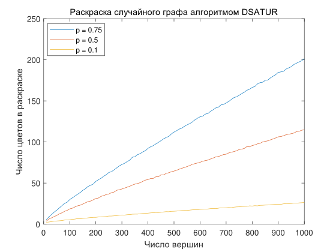

## This is test website page / project page

**Project description:** test message.

### 1. Test section first, wow!

This is test section. Preamble. Test program (lg: cpp) "Hello world":

```cpp
int main() {
  cout << "Hello World! ";
}
```

### 2. Test section second, wow!

Try to guess what this program will output

```python
a, b = 0, 1
while b < 10:
    print(b)
    a, b = a, a + b
```
### 3. Picture

Test img on website: <br>



This page was generated by markdown. For more details see [GitHub Flavored Markdown](https://guides.github.com/features/mastering-markdown/).
